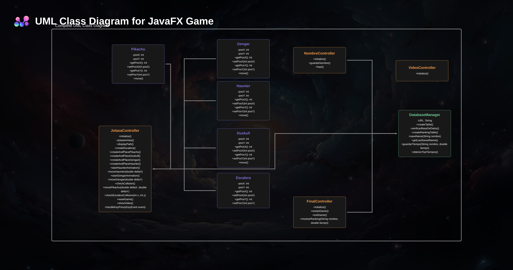

# 🎮 Proiektua: Pikachu Jokoa JavaFX eta Mavenekin

## 📌 Deskribapena

Hau **JavaFX**-en oinarritutako joko bat da, non jokalariak **Pikachu** kontrolatzen duen labirinto batean eta **eskailerara (Escalera)** iritsi behar duen etsaiak (**Duskull, Gengar eta Haunter**) ekidinez. Jokoak animazioak, kolisio detekzioa, kronometroa eta puntuazioak datu-basean gordetzeko aukera eskaintzen du.

Proiektua **JavaFX eta Maven** erabiliz garatu da, **Java 13** bertsioarekin.

---

## 📁 Proiektuaren Egituraketa

```
📂 src/main/java/dambat
 ├── 📂 controller       # Kontroladoreak (JolasaController, FinalController...)
 ├── 📂 database         # Datu-basearen kudeaketa (DatabaseManager)
 ├── 📂 model            # Jokoaren entitateak (Pikachu, Gengar, Haunter...)
 ├── 📂 resources        # Baliabideak (irudiak, bideoak, FXML fitxategiak)
 └── 📂 main             # Aplikazioaren abiarazlea (App.java)
```

---

## 📊 Klase Diagrama

Behean proiektuaren klase egitura ikus daiteke:

<p align="center">
  
</p>>

**Oharra:** Diagrama honek klase nagusiak eta haien arteko erlazioak erakusten ditu.

---
## 🎮 JavaFX Jokoaren UML Klase Diagrama

### 📌 Klaseak:

#### **JolasaController** (Jokoaren kontroladorea)
```java
+ initialize()
+ jolastenHasi()
+ displayPath()
+ createEscalera()
+ createAndPlacePikachu()
+ createAndPlaceDuskull()
+ createAndPlaceGengar()
+ createAndPlaceHaunter()
+ startHaunterAnimation()
+ moveHaunter(double deltaX)
+ startGengarAnimation()
+ moveGengar(double deltaY)
+ checkCollision()
+ movePikachu(double deltaX, double deltaY)
+ checkEscaleraCollision(int x, int y)
+ resetGame()
+ showVideo()
+ handleKeyPress(KeyEvent event)
```

#### **FinalController** (Azken eszena kontroladorea)
```java
+ initialize()
+ restartGame()
+ exitGame()
+ mostrarRanking(String nombre, double tiempo)
```

#### **NombreController** (Izena sartzeko kontroladorea)
```java
+ initialize()
+ guardarNombre()
+ hasi()
```

#### **VideoController** (Bideo eszena kontroladorea)
```java
+ initialize()
```

#### **DatabaseManager** (Datu-basearen kudeatzailea)
```java
- URL: String
+ createTable()
+ verificarBaseDeDatos()
+ createRankingTable()
+ saveName(String nombre)
+ getLastSavedName()
+ guardarTiempo(String nombre, double tiempo)
+ obtenerTopTiempos()
```

---

### 🔗 Harremanak:

- **JolasaController** klaseak **Pikachu**, **Gengar**, **Haunter**, **Duskull**, eta **Escalera** entitateak kudeatzen ditu.
- **JolasaController** klaseak **DatabaseManager** klasearekin elkarreragiten du puntuazioak gordetzeko.
- **FinalController** klaseak **DatabaseManager** klasearen datuak erabiltzen ditu.
- **NombreController** klaseak **DatabaseManager** klasean izenak gorde ditzake.
- **VideoController** klasea **JolasaController** klaseak abiarazten du, jokalariak irabazten duenean.

---

### 📌 UML Klase Diagrama

```
      +----------------+                   +------------------+
      | JolasaController|<------------------|  DatabaseManager |
      +----------------+                   +------------------+
      | - initialize()  |                   | - URL: String    |
      | + jolastenHasi()|                   | + createTable()  |
      | + displayPath()  |                   | + verificarBaseDeDatos() |
      | + createEscalera()|                  | + createRankingTable() |
      | + createAndPlacePikachu()|           | + saveName(String nombre) |
      | + createAndPlaceDuskull()|           | + getLastSavedName() |
      | + createAndPlaceGengar()|            | + guardarTiempo(String nombre, double tiempo) |
      | + createAndPlaceHaunter()|           | + obtenerTopTiempos() |
      | + startHaunterAnimation()|           +------------------+
      | + moveHaunter(double deltaX)|
      | + startGengarAnimation() |
      | + moveGengar(double deltaY)|
      | + checkCollision() |
      | + movePikachu(double deltaX, double deltaY)|
      | + checkEscaleraCollision(int x, int y)|
      | + resetGame() |
      | + showVideo() |
      | + handleKeyPress(KeyEvent event) |
      +------------------+
          ^
          |
          |
    +------------------+          +------------------+
    | FinalController  |<-------->| NombreController |
    +------------------+          +------------------+
    | + initialize()   |          | + initialize()   |
    | + restartGame()  |          | + guardarNombre()|
    | + exitGame()     |          | + hasi()         |
    | + mostrarRanking()|         +------------------+
    +------------------+

          ^
          |
          |
     +------------------+
     | VideoController  |
     +------------------+
     | + initialize()   |
     +------------------+
```

---

### 🎯 Entitateak:

#### **Pikachu** (Jokalari entitatea)
```java
- posX: int
- posY: int
+ getPosX(): int
+ setPosX(int posX)
+ getPosY(): int
+ setPosY(int posY)
+ move()
```

#### **Gengar** (Atsotzeko entitatea)
```java
- posX: int
- posY: int
+ getPosX(): int
+ setPosX(int posX)
+ getPosY(): int
+ setPosY(int posY)
+ move()
```

#### **Haunter** (Atsotzeko entitatea)
```java
- posX: int
- posY: int
+ getPosX(): int
+ setPosX(int posX)
+ getPosY(): int
+ setPosY(int posY)
+ move()
```

#### **Duskull** (Atsotzeko entitatea)
```java
- posX: int
- posY: int
+ getPosX(): int
+ setPosX(int posX)
+ getPosY(): int
+ setPosY(int posY)
+ move()
```

#### **Escalera** (Helburua)
```java
- posX: int
- posY: int
+ getPosX(): int
+ setPosX(int posX)
+ getPosY(): int
+ setPosY(int posY)
```

---

## 📖 Deskribapena

Gorago aipatutako UML diagramak JavaFX bidezko joko baten egitura eta klase harremanak erakusten ditu. Jokoan **Pikachu** bezala ezagutzen den jokalariaren entitateak mugimendua eta helburua lortzeko pausoak dituen kontrolatzaile bat du, eta **Atsotzeko** entitateak **Gengar**, **Haunter**, eta **Duskull** barne hartzen ditu, bakoitzak bere posizioa eta mugimendu funtzionalitatea ditu. **Escalera** helburu gisa kudeatzen da, eta **JolasaController** klaseak guztiak koordinatzen ditu.


📜 Metodo Guztien Azalpena

🎮 JolasaController metodoak

initialize() → Jokoa hastean elementuak sortzen ditu.

jolastenHasi() → Jokoa abiarazten du eta kronometroa martxan jartzen du.

displayPath() → Bide egokia erakusten du grid batean.

createEscalera() → Eskaileraren objektua sortzen du.

createAndPlacePikachu() → Pikachu objektua sortu eta kokatzen du.

createAndPlaceDuskull() → Duskull objektua sortzen du.

createAndPlaceGengar() → Gengar objektua sortu eta grid-ean kokatzen du.

createAndPlaceHaunter() → Haunter objektua sortzen du.

startHaunterAnimation() → Haunter-en mugimendu animazioa hasten du.

moveHaunter(double deltaX) → Haunter mugitzen du.

startGengarAnimation() →

## ⚙️ Instalazioa eta Exekuzioa

### 📦 Beharrezko softwarea

- **Java 13** edo bertsio berriagoa
- **Apache Maven**
- **SQLite (datu-basea erabiltzeko)**

### 📥 Instalazio Pausoak

1. Proiektua klonatu edo deskargatu:
   ```sh
   git clone https://github.com/ibaiperezg/Pokemon24-25.git
   cd Pokemon24-25
   ```
2. Maven bidez exekutatu:
   ```sh
   mvn javafx:run
   ```

---

## 🗄️ Datu-basearen Konfigurazioa

Jokoak **SQLite** erabiltzen du puntuazioak gordetzeko. **DatabaseManager.java** fitxategiak datu-basearekin konektatzen du eta erabiltzailearen puntuazioak kudeatzen ditu.

### 📂 Taulen Egituraketa

```sql
CREATE TABLE IF NOT EXISTS jugadores (
    id INTEGER PRIMARY KEY AUTOINCREMENT,
    nombre TEXT
);

CREATE TABLE IF NOT EXISTS ranking (
    id INTEGER PRIMARY KEY AUTOINCREMENT,
    nombre TEXT NOT NULL,
    tiempo REAL NOT NULL
);
```

### 📡 Konfigurazioa (`DatabaseManager.java`)

Datu-basearen konexioa:

```java
private static final String URL = "jdbc:sqlite:nombres.db";
```

> **⚠️ Oharra:** Datu-basea lokalki gordetzen da `nombres.db` fitxategian.

### 📜 DatabaseManager metodoak

- **createTable()** → `jugadores` taula sortzen du, existitzen ez bada.
- **verificarBaseDeDatos()** → Datu-baseko taulak zerrendatzen ditu kontsolan.
- **createRankingTable()** → `ranking` taula sortzen du, existitzen ez bada.
- **saveName(String nombre)** → Jokalariaren izena datu-basean gordetzen du.
- **getLastSavedName()** → Azken gordetako izena berreskuratzen du.
- **guardarTiempo(String nombre, double tiempo)** → Jokalariaren denbora datu-basean gordetzen du.
- **obtenerTopTiempos()** → 5 denbora onenak berreskuratzen ditu.

---

## 📜 Metodo Guztien Azalpena

### 🎮 JolasaController metodoak

- **initialize()** → Jokoa hastean elementuak sortzen ditu.
- **jolastenHasi()** → Jokoa abiarazten du eta kronometroa martxan jartzen du.
- **displayPath()** → Bide egokia erakusten du grid batean.
- **createEscalera()** → Eskaileraren objektua sortzen du.
- **createAndPlacePikachu()** → Pikachu objektua sortu eta kokatzen du.
- **createAndPlaceDuskull()** → Duskull objektua sortzen du.
- **createAndPlaceGengar()** → Gengar objektua sortu eta grid-ean kokatzen du.
- **createAndPlaceHaunter()** → Haunter objektua sortzen du.
- **startHaunterAnimation()** → Haunter-en mugimendu animazioa hasten du.
- **moveHaunter(double deltaX)** → Haunter mugitzen du.
- **startGengarAnimation()** → Gengar-en mugimendu animazioa hasten du.
- **moveGengar(double deltaY)** → Gengar mugitzen du.
- **checkCollision()** → Pikachu eta etsaiak talka egiten duten egiaztatzen du.
- **movePikachu(double deltaX, double deltaY)** → Pikachu-ren mugimendua kudeatzen du.
- **checkEscaleraCollision(int x, int y)** → Pikachu eskailerara iritsi den egiaztatzen du.
- **resetGame()** → Jokoa berrabiarazten du.
- **showVideo()** → Azken bideoa bistaratzen du.
- **handleKeyPress(KeyEvent event)** → Teklatuaren bidezko ekintzak kontrolatzen ditu.

---

## 📚 Erabilitako Teknologiak

- **Java 13** → Programazio hizkuntza
- **JavaFX** → Interfaze grafikoa eta animazioak
- **Maven** → Menpekotasunen kudeaketa eta konpilazioa
- **SQLite** → Datu-basea denbora gordetzeko


## 🎮 Jokoaz gozatu!

Zalantzarik baduzu edo hobekuntzarik proposatu nahi baduzu, **proiektuan parte hartu!** 🚀

